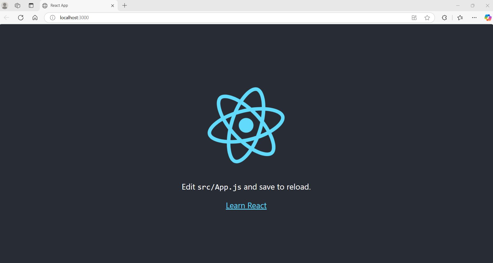

# InvestorFlow Tech Assignment



## Prerequisites

```bash
brew install pre-commit
pre-commit install
pre-commit run --all-files
```

## Local app

```bash
# raw app
cd app
npm install 
npm run

# container build

docker build -t investorflow:dev .
docker run -p 81:80 investorflow:dev
```

## Infra deployment (without pipeline)

```bash
az login

az account show
az account list --output table
az account set --subscription <subscription-id>

### Old TF 

terraform init
terraform workspace new dev || terraform workspace select dev
terraform plan -var-file=environments/dev/dev.tfvars
terraform apply -var-file=environments/env/dev.tfvars

## Check local

az containerapp list --resource-group <rg-name> -o table

az containerapp show \
  --name investorflow-dev \
  --resource-group investorflow-dev-rg \
  --query properties.latestRevisionFqdn \
  -o tsv
```

## Updated

```bash
cd infra
tf init
tf plan -var-file=../environments/dev/dev.tfvars
tf apply -var-file=../environments/dev/dev.tfvars
```